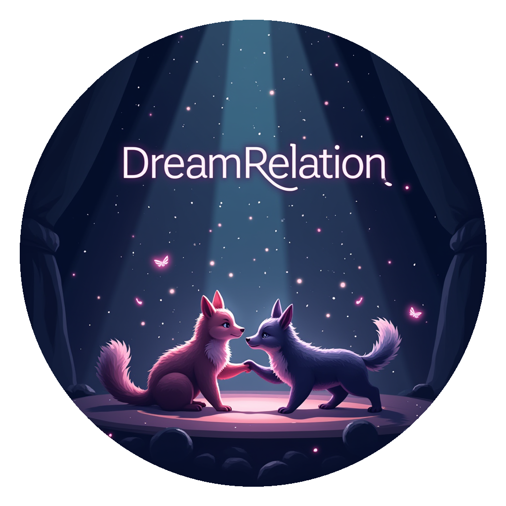

<div align="center">

</div>

# [ICCV 2025] DreamRelation: Relation-Centric Video Customization

<div align="center">

[](https://arxiv.org/abs/2503.07602) 
[](https://openaccess.thecvf.com/content/ICCV2025/papers/Wei_DreamRelation_Relation-Centric_Video_Customization_ICCV_2025_paper.pdf)
[](https://dreamrelation.github.io/)


_**[Yujie Wei](https://weilllllls.github.io), [Shiwei Zhang](https://scholar.google.com.hk/citations?user=ZO3OQ-8AAAAJ), [Hangjie Yuan](https://jacobyuan7.github.io), [Biao Gong](https://scholar.google.com/citations?user=BwdpTiQAAAAJ), [Longxiang Tang](https://scholar.google.com/citations?user=3oMQsq8AAAAJ), [Xiang Wang](https://scholar.google.com/citations?user=cQbXvkcAAAAJ), [Haonan Qiu](http://haonanqiu.com), [Hengjia Li](https://echopluto.github.io/HomePage/), [Shuai Tan](), [Yingya Zhang](https://scholar.google.com/citations?user=16RDSEUAAAAJ), [Hongming Shan](http://hmshan.io)**_
</div>

Relational video customization refers to the creation of personalized videos that depict user-specified relations between two subjects, a crucial task for comprehending realworld visual content. While existing methods can personalize subject appearances and motions, they still struggle with complex relational video customization, where precise relational modeling and high generalization across subject categories are essential. The primary challenge arises from the intricate spatial arrangements, layout variations, and nuanced temporal dynamics inherent in relations; consequently, current models tend to overemphasize irrelevant visual details rather than capturing meaningful interactions.


To address these challenges, we propose **DreamRelation**, a novel approach that personalizes relations through a small set of exemplar videos, leveraging two key components: Relational Decoupling Learning and Relational Dynamics Enhancement. First, in Relational Decoupling Learning, we disentangle relations from subject appearances using relation LoRA triplet and hybrid mask training strategy, ensuring better generalization across diverse relationships. Furthermore, we determine the optimal design of relation LoRA triplet by analyzing the distinct roles of the query, key, and value features within MM-DiT's attention mechanism, making DreamRelation the first relational video generation framework with explainable components. Second, in Relational Dynamics Enhancement, we introduce spacetime relational contrastive loss, which prioritizes relational dynamics while minimizing the reliance on detailed subject appearances. Extensive experiments demonstrate that DreamRelation outperforms state-of-the-art methods in relational video customization.


## ⚙️ Installation

### 1. Prepare Environment and Pretrained Models

Follow the official installation instructions for Mochi 1 to set up your environment and download the necessary pretrained models. You can find the guide here: [Mochi 1 Official Repository](https://github.com/genmoai/mochi?tab=readme-ov-file#installation).

### 2. Place Mochi 1 Checkpoints

Move the downloaded Mochi 1 pretrained checkpoints into the `pretrained_models/mochi` directory.

### 3. Place T5 Checkpoints

Move the downloaded T5 pretrained checkpoints into the `pretrained_models/t5-v1_1-xxl` directory.


## 🤗 Examples

### 1. Download Pre-trained Models

We provide pre-trained LoRA models for the `high-five` and `shaking hands` relations to help you get started. You can download them from either ModelScope or Hugging Face Hub.

**Download from ModelScope**
```bash
pip install modelscope==1.23.0
modelscope download --model weilllllls/DreamRelation --local_dir checkpoints
```

**Download from Hugging Face**
```bash
pip install -U huggingface_hub
huggingface-cli download --resume-download weilllllls/DreamRelation --local-dir checkpoints
```

### 2. Run Example Command

```bash
# shaking hands
CUDA_VISIBLE_DEVICES=0 python demos/cli.py \
    --model_dir pretrain_models_ckpt/mochi-1-preview/ \
    --lora_path checkpoints/examples/shaking_hands/model_2000.lora.pt \
    --num_frames 61 \
    --cpu_offload \
    --prompt "A bear is shaking hands with a raccoon in a meadow." \
    --seed 522 \
    --train_cfg_path demos/fine_tuner/configs/shaking_hands/example.yaml \
    --test_lora_names relation

# high-five
CUDA_VISIBLE_DEVICES=0 python demos/cli.py \
    --model_dir pretrain_models_ckpt/mochi-1-preview/ \
    --lora_path checkpoints/examples/high-five/model_1800.lora.pt \
    --num_frames 61 \
    --cpu_offload \
    --prompt "A real-world bear is high-fiving with a real-world raccoon in a serene forest clearing." \
    --seed 1832 \
    --train_cfg_path demos/fine_tuner/configs/high-five/example.yaml \
    --test_lora_names relation
```

## 🔥 Training

### 1. Prepare Dataset

The training videos are sourced from the [NTU RGB+D dataset](https://rose1.ntu.edu.sg/dataset/actionRecognition/). **Due to the dataset's usage policy, we cannot directly provide the NTU RGB+D relational videos**. Please apply for authorization to the NTU RGB+D dataset yourself and download the relevant relational videos. The names of all 26 relation types and their corresponding captions are provided in Table 8 of our paper.

Once the training videos are prepared, randomly select 20–30 videos for each relation and place them under `videos/NTU_RGB_D`.
For each video, also create a text file with the same name to contain the video's caption. 
For example, for one `A58: shaking hands` video `S001C001P001R001A058_rgb.mp4`, place it under `videos/NTU_RGB_D/A58-shaking_hands` and create `S001C001P001R001A058_rgb.txt`, writing the caption "A person is shaking hands with a person." into the file.


### 2. Preprocess Videos

First, install `bc` if you don't have it:

```bash
sudo apt-get update
sudo apt-get install bc
```

Then, preprocess your videos using the script:

```bash
bash demos/fine_tuner/preprocess.bash -v videos/NTU_RGB_D/A58-shaking_hands/ -o videos_prepared/NTU_RGB_D/A58-shaking_hands/ -w pretrain_models_ckpt/mochi-1-preview --num_frames 61
```

You can adjust the `--num_frames` flag to specify the number of frames to extract for each video.

### 3. Prepare Video Masks

Generate masks for your videos using either [Grounded-SAM](https://github.com/IDEA-Research/Grounded-Segment-Anything) or [SAM 2](https://github.com/facebookresearch/segment-anything).
We have provided the example masks of one video in `videos/NTU_RGB_D/A58-shaking_hands_masks`.


### 4. Start Training

```bash
CUDA_VISIBLE_DEVICES=0 COMPILE_DIT=1 python demos/fine_tuner/train.py --config-path demos/fine_tuner/configs/shaking_hands/example.yaml
```

**Training Tips:**
*   Generally, `1800 to 2400` training steps are sufficient. However, we recommend adjusting the training steps based on different relations to achieve optimal results.
*   Default hyperparameters are in `demos/fine_tuner/configs/high-five/example.yaml`. For various relations, adjust `total_positive_nums` and `total_negative_nums` in relational contrastive learning for better results.
*   A GPU with 80 GB VRAM is recommended for training. If you have limited VRAM, you can reduce the number of frames in the `Preprocess Videos` step. The default number of frames for training is 61.
*   The current code primarily supports training with a batch size of 1. If you intend to use a batch size greater than 1, careful code review and modifications will be necessary.


## 💫 Inference

To run inference using a trained LoRA model:

```bash
CUDA_VISIBLE_DEVICES=0 python demos/cli.py \
    --model_dir pretrain_models_ckpt/mochi-1-preview/ \
    --lora_path finetunes/example/NTU_RGB_D/A58-shaking_hands/model_2000.lora.pt \
    --num_frames 61 \
    --cpu_offload \
    --prompt "A bear is shaking hands with a raccoon in a meadow." \
    --seed 522 \
    --train_cfg_path demos/fine_tuner/configs/shaking_hands/example.yaml \
    --test_lora_names relation
```

## Acknowledgement

This code is built on top of [Mochi 1](https://github.com/genmoai/mochi). We thank the authors for their great work.

## 🌟 Citation

If you find this code useful for your research, please cite our paper:

```bibtex
@inproceedings{wei2025dreamrelation,
  title={DreamRelation: Relation-Centric Video Customization},
  author={Wei, Yujie and Zhang, Shiwei and Yuan, Hangjie and Gong, Biao and Tang, Longxiang and Wang, Xiang and Qiu, Haonan and Li, Hengjia and Tan, Shuai and Zhang, Yingya and others},
  booktitle={Proceedings of the IEEE/CVF International Conference on Computer Vision},
  year={2025}
}

@inproceedings{wei2024dreamvideo,
  title={DreamVideo: Composing Your Dream Videos with Customized Subject and Motion},
  author={Wei, Yujie and Zhang, Shiwei and Qing, Zhiwu and Yuan, Hangjie and Liu, Zhiheng and Liu, Yu and Zhang, Yingya and Zhou, Jingren and Shan, Hongming},
  booktitle={Proceedings of the IEEE/CVF Conference on Computer Vision and Pattern Recognition},
  pages={6537--6549},
  year={2024}
}

@article{wei2024dreamvideo2,
  title={DreamVideo-2: Zero-Shot Subject-Driven Video Customization with Precise Motion Control},
  author={Wei, Yujie and Zhang, Shiwei and Yuan, Hangjie and Wang, Xiang and Qiu, Haonan and Zhao, Rui and Feng, Yutong and Liu, Feng and Huang, Zhizhong and Ye, Jiaxin and others},
  journal={arXiv preprint arXiv:2410.13830},
  year={2024}
}
```
